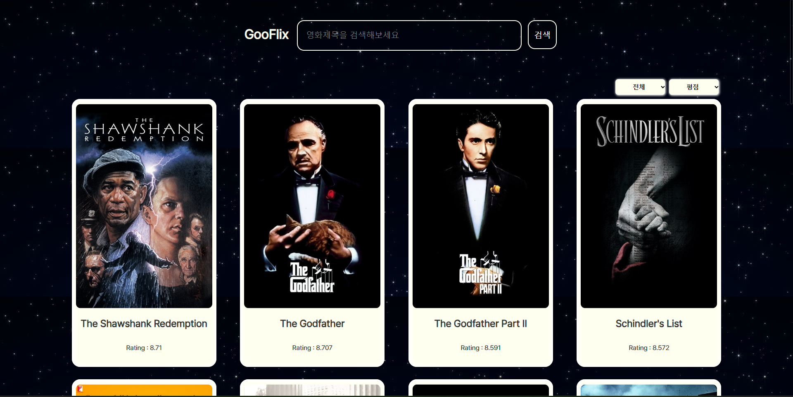

# 내배캠 인기영화 콜렉션 ( GooFlix )

이 프로젝트는 내배캠에서 진행된 1조의 팀 프로젝트로,   
인기 영화 목록을 보여주는 웹 애플리케이션입니다. 상세페이지가 구현되어 있습니다.

이재헌 https://github.com/wogjs5656/  
역할: 팀장, 리뷰카드 생성 및 삭제 기능 구현  

강다빈 https://github.com/ratempty/  
역할: 부팀장 카테고리 및 메인페이지 구현  

구혜인 https://github.com/ghi3621  
역할: 팀원 상세페이지 API 구현  

조민근 https://github.com/alsgeun  
역할: 팀원 메인페이지 상세페이지 css 구현  

류기돈 https://github.com/lyukid0n  
역할: 팀원 메인페이지, 상세페이지 및 리뷰 수정, 로컬스토리지 구현  

## Installation

1. 저장소 클론
    ```bash
      git clone https://github.com/wogjs5656/MY-TEAM-PROJECT.git
    ```

2. apikey.js를 script 디렉터리에 추가
    ```js
      const config = {
            apikey: "YOUR APIKEY",
            accessToken: "YOUR AccessToken",
      };
    ```
    <u>**참고: API 키와 액세스 토큰은 TMDB API에서 발급받을 수 있습니다.**</u>

3. index.html  실행

## Description

1조 연년은 팀원 강다빈님의 과제를 베이스로 채택하였으며,  
이후 필수요구사항과 선택요구사항을 나눠 기능을 분담했습니다.



전체적인 디자인은 기존 베이스에서 크게 벗어나지 않음과 동시에  
여타 OTT 사이트 들과는 다른 방식으로 진행했으며,  

Back-end 단에서 디자인은 큰 고려사항이 아니지만 디자인 담당 뿐만  
아니라 나름 다른조원 분들의 디테일적인 의견들이 녹여져 있는 부분이라고 생각합니다.
## Feature
  - 페이지 이동
    - Query String 이용
  - 카테고리
    - 장르와 발매일,이름,평점 순으로 정렬은 기존 받아온 api를 기반으로 정렬하되 발매일은 각 카드에서 바로 비교할 수 없어서 객체에 저장 후 다시 비교하는 방식을 사용했습니다.
  - API 사용
    - TMDB의 최고평점순 api와 각 movieID를 기준으로 상세정보를 받아오는 api를 사용했습니다.
  - 리뷰
    - 데이터 형태
      ```json
      [
        {
          id: ""<String>,
          pw: ""<String>,
          review: ""<String>,
          review-id: ""<String>,
        }
      ]
      ```
    - review-id
      - uuid
        ```js
        xxxxxxxx-xxxx-xxxx-xxxx-xxxxxxxxxxxx 
        // 8-4-4-4-12
        ```
    - localStorage 사용
      - 조회
        ```js
          const getReview = async () => {
            let data = JSON.parse(await localStorage.review);
            return data;
          };
        ```
      - 추가
        ```js
          const createReview = async (id, review, pw) => {
            let prevReview = await getReview();
            let review_id = uuid();
            let newReview = { id, pw, review, review_id };
            localStorage.review = JSON.stringify([...prevReview, newReview]);
          };
        ```
      - 제거
        ```js
          const deleteReview = async (uuid, pw) => {
            let prevReview = await getReview();
            let reviewToDelete = prevReview.find((review) => review.review_id === uuid);

            if (reviewToDelete && reviewToDelete.pw === pw) {
              let updatedReviewList = prevReview.filter((review) => review.review_id !== uuid);
              localStorage.review = JSON.stringify(updatedReviewList);
            } else {
              alert("해당 비밀번호가 일치하지 않습니다.");
            }
          };
        ```
      - 수정
        ```js
          const updateReview = async (uuid, pw, newContent) => {
            let prevReview = await getReview();
            let editReview = prevReview.map((review) => {
                if (review.review_id === uuid && review.pw === pw) {
                    review.review = newContent;
                } else if (review.review_id === uuid && review.pw !== pw) {
                    alert("비밀번호가 틀렸습니다");
                }
                return review;
            });
            localStorage.review = JSON.stringify([...editReview]);
          };
        ```

## Project Review
- 첫 협업이지만 의사소통이 잘 되어 순조롭게 진행되었습니다.
- 팀원 간의 코드 리뷰를 통해 오류해결이 용이했습니다.
- git bash를 통해 repositories를 컨트롤 하는데 익숙해졌습니다.
